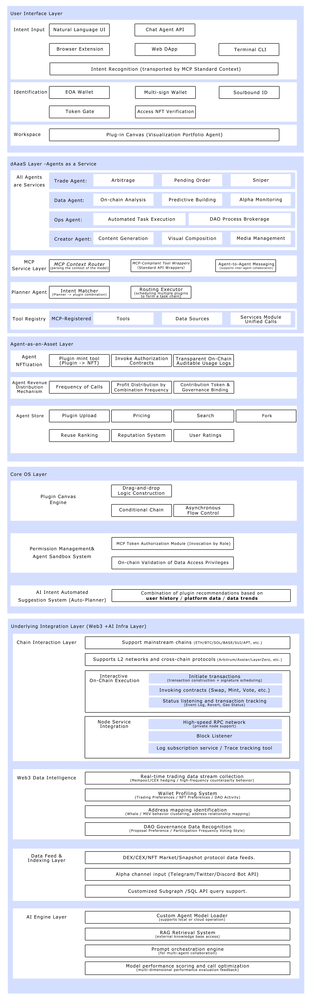

## Contact
- [Discord](https://discord.com/invite/5thjdHfFyK)
-  [X](https://x.com/ChainAiNexus[)
-  [Gitbook](https://chain-ai-nexus.gitbook.io/chain-ai-nexus/)

# MCP + Modular AI + Web3 Architecture for the Next Generation of Intent Centers

## Intro
We are building the first decentralized Agent-as-a-Service (dAaaS, decentralized Agent-as-a-Service) operating system based on the MCP.

ChainAINexus (CAN) is a modular AI + Web3 operating system dedicated to reshaping how intelligences are deployed, interacted with, and economically modeled. It allows developers to build combinable and reusable on-chain intelligence modules (plug-ins) and connect them to data streams, tool stacks, and task networks through the MCP, realizing an integrated closed-loop of multi-intelligence collaboration, strategic invocation, on-chain interaction, and token billing.

The aim of CAN is to deconstruct intelligences by means of modules, reorganize intelligences by means of on-chain mechanisms, release the productivity of intelligences by means of token logic, and ultimately build an open, automated and economy-driven network of intelligences.

# Advantageous Features

## Module is Intelligence, Plugin is Service (dAaaS)

-  CAN adopts a highly modularized design, and each Plugin is an Intelligent Body (Agent), which can be freely combined, dispatched, and invoked.
-  Zero-code assembly through drag-and-drop canvas, user ease of use is improved.
-  Module assembly is service creation, and intent input is service invocation.

## Plug-in as Asset, Intelligent Body Sovereignty (dAaaA)

-  All plug-ins can be NFTized, uplinked to confirm rights, trading, and governance.
-  Intelligent bodies can independently set the invocation price, frequency, and open groups to realize assetization and revenue distribution.
-  Agent is not only a tool, but also an economic role on the chain, which can operate and benefit independently.

## AI-driven automatic scheduling of intelligent bodies

-  The system continuously learns users' plug-in combination behaviors to optimize intent recognition and intelligent recommendation.
-  Supports automatic replenishment of missing modules and optimization of intelligent body combination schemes based on data preferences.
-  CAN is a self-evolving AI+ intelligent body operating system.

## Native integration of AI and Web3 ecology

-  Native support for on-chain data monitoring, automatic transaction execution, and cross-chain operations.
-  Integrates NLP, graph neural network, and multimodal processing capabilities to provide real-time data fuel for Agents.
-  Not just AI connecting to Web3, but creating a cognitive collaboration structure between AI and Web3.

## Open self-growing plugin ecosystem

-  Each plugin is reusable, combinable, and can be licensed for secondary development, forming an exponentially growing combinatorial network.
-  Community co-built intelligences stacks (e.g. DAO operational intelligences collection), co-creating intelligences economic ecology.

# System Architecture Diagram

The system architecture of ChainAINexus is organized into 5 layers as shown below:




## 1. User Interface Layer

The ChainAINexus (CAN) User Interface Layer (UIL) is the first point of entry for connecting human intent to the intelligent systems on the chain. It carries all the functions of intent capture, authentication and task flow configuration to ensure that users can participate in the multi-intelligence economic network in the most natural and lowest barrier way.

The design of this layer is guided by the following core principles:

- **Intent Driven Priority**: users simply express 'what they want to do' without having to understand complex on-chain details.
- **Identity Trusted Autonomy**: supports decentralized identity and multi-signature mechanism to ensure on-chain control of assets and permissions.
- **No-code Building Experience**: through the visualization workspace, you can build, deploy, and manage your own smart body task flow with zero code.

## 2. dAaaS Layer - Agents as a Service

The Agent Service Layer of ChainAINexus (CAN) is the power engine for the system to implement the Decentralized Agent as a Service (dAaaS) paradigm.

In this layer, each Agent (plug-in module) follows the unified MCP protocol and can run independently, be invoked in combination, be registered on the chain, and become part of the chain's smart economy cycle.

## 3. Agent-as-an-Asset Layer

In ChainAINexus (CAN), Agent is not only a functional module that can be invoked, but also a form of digital asset with the right to own, use, and gain on the chain.

Through Agent NFTization, revenue sharing mechanism and plug-in market system, each Agent can become an independent asset unit in the decentralized economic system. It realizes the complete life cycle of:

> "creating value → being invoked → obtaining income → being governed → being circulated".

## 4. Core OS Layer

The core OS layer of ChainAINexus (CAN) is the operational kernel that runs the entire smart body economy. It ensures the free combination of plug-ins, safe execution of tasks, controlled access to data, and optimization of intelligent recommendations. Thus, it supports a On-chain Modular Intelligence OS that can evolve itself.

## 5. Bottom Integration Layer (Web3 + AI Infra Layer)

Provides a base for on-chain interaction, data processing and AI reasoning, supporting modular operation and evolution of intelligences:

- **Chain Interaction Layer**:  
  Natively supports mainstream chains (ETH, SOL, BASE, SUI, APT, etc.) and cross-chain protocols (Arbitrum, Axelar, LayerZero, etc.), including common on-chain operations such as transaction construction, signature scheduling, Swap transactions, Mint casting, governance voting, and real-time monitoring of transaction status and Gas consumption.

- **Node Services**:  
  Integrates high-speed private RPC network, supports on-chain Block Listener, Log Subscription, and Trace Tracking, ensures timely data capture and stable interaction execution, and provides low-latency on-chain interaction experience for Agents.

- **Web3 Data Intelligence**:  
  Provides real-time transaction flow capture (e.g., Mempool listening, CEX price hedging signals), wallet profiling (user trading preferences, NFT positions, DAO activity analysis), whale behavior detection and address mapping analysis, which help Agents make more accurate data decisions.

- **Data Feed & Indexing Layer**:  
  Aggregates on-chain and off-chain data sources such as DEX, CEX, NFT market, Snapshot governance, etc., and supports Alpha channel access (Telegram, Twitter, Discord Bot API), and opens up customized Subgraph query and SQL interface to ensure that Agents can make more accurate data decisions.

- **AI Engine Layer**:  
  Supports custom Agent model loading (locally or in the cloud), introduces RAG (Retrieval Augmentation Generation) system to expand the knowledge base of Intelligent Bodies, has a built-in Prompt orchestration engine, supports multi-Agent collaborative reasoning, and continuously optimizes the model performance and the calling paths to ensure that Intelligent Bodies keep evolving efficiently.

# Tech Stack and Dependencies

ChainAINexus uses a variety of technologies and frameworks to build its powerful functional modules, including but not limited to:

- **Smart Contract Development**: Rust / Solidity / Vyper. Used to develop the platform's core Governance Contracts, Pledge Contracts, Split Contracts, and more.

- **Artificial Intelligence**: Python. Used to implement AI algorithm modules such as Natural Language Understanding (NLU), Sentiment Analysis, Intent Recognition, Predictive Analytics, etc.

- **Front-end and Back-end**:
  - Front-end: React.js / Next.js. Used to build user interaction interface (Google extension, Dapp, etc.).
  - Backend: Node.js / Express.js / Flask. Used to provide API and server-side support.

- **Database**: MongoDB / PostgreSQL. Used to store plugin data and user interaction records.

- **Dependencies**:
  - Web3.js / ethers.js: for interacting with the blockchain.
  - Docker: for containerized deployment and support for cross-platform operation.

# Quick Start

Before running the install command, make sure Docker and Docker Compose are installed on your console:

### Local Console Environment Startup

```bash
cd docker
cp .env.example .env
docker compose up -d
```
Once running, you can access the ChainAINexus console and begin the initial installation operation by visiting http://localhost/install on your browser.
# Sample

## 1. Whale Watcher Agent

The Whale Watcher Agent tracks large whale wallet behavior across the chain in real-time, including token buys, transfers, pledges, and trading activity.

The smart body can not only automatically generate alerts based on on-chain events (e.g. ERC20 Transfer), but also trigger automated transactions based on pre-set strategies (e.g. synchronized buying within 10 minutes of a whale buy).

**Applicable Scenarios**:  
Alpha Capture, Fast Response to Whale Actions, Protecting Positions.

### Simple function code demonstration

```python
from web3 import Web3
import requests

# Initialize the chain listener
w3 = Web3(Web3.HTTPProvider('https://mainnet.infura.io/v3/your_project_id'))
target_wallets = ['0xWhaleWalletAddress1', '0xWhaleWalletAddress2']

# Detect transfer events
def monitor_whale_activity():
    latest_block = w3.eth.blockNumber
    logs = w3.eth.get_logs({
        'fromBlock': latest_block - 20,
        'toBlock': latest_block,
        'address': '0xTokenAddress',  # listen for specific tokens
    })
    for log in logs:
        from_addr = '0x' + log['topics'][1].hex()[-40:]
        if from_addr.lower() in [addr.lower() for addr in target_wallets]:
            trigger_trade_action()

# Trigger a preset trade
def trigger_trade_action():
    print("Detected Whale Activity! Executing Preemptive Buy...")
    # Example of calling a wallet for a quick pending order
    # execute_trade('Buy', token_address, amount)

# Main loop listener
if __name__ == "__main__":
    while True:
        time.sleep(1)
        monitor_whale_activity()
```
## 2. DAO Auto-Governor

The DAO Auto-Governor Agent is responsible for continuously listening to DAO proposal systems (e.g. Snapshot, Tally) and collecting proposal creation and voting dynamics in real-time.

Combined with the community's preset voting preferences (e.g., support for eco-extension proposals, opposition to financial expenditure proposals), the intelligent body automatically analyzes trends and executes on-chain or API voting actions.

**Applicable Scenarios**:  
Large-scale DAO governance participation, human lag reduction, strategy consistent governance.

### Simple functional code demonstration

```python
import requests
from web3 import Web3

DAO_SNAPSHOT_URL = "https://hub.snapshot.org/graphql"
VOTING_WALLET_PRIVATE_KEY = "your_private_key"

# Query the latest proposals
def fetch_latest_proposals(space_id):
    query = {
        "query": """
        {
          proposals(first: 5, where: { space_in: ["%s"] }, orderBy: "created", orderDirection: desc) {
            id
            choices
            start
            end
          }
        }
        """ % space_id
    }
    response = requests.post(DAO_SNAPSHOT_URL, json=query)
    return response.json()["data"]["proposals"]

# Simple strategy voting decision
def decide_vote(proposal):
    if "expand" in proposal["title"].lower():
        return 1  # Option 1: support
    return 2  # Option 2: against

# Sign and send the vote (simplified version)
def cast_vote(proposal_id, choice):
    # Sign the Snapshot Message and send it
    print(f"Casting vote {choice} for proposal {proposal_id}")

# Main Stream
if __name__ == "__main__":
    proposals = fetch_latest_proposals("your_dao_space_id")
    for proposal in proposals:
        decision = decide_vote(proposal)
        cast_vote(proposal["id"], decision)
```

## 3. Alpha Sniper Bot

Alpha Sniper Bot proactively scans sources such as Mempool unlinked transactions, Telegram Alpha channels, Twitter, Discord, etc. for early signals such as new token deployments, IDO announcements, whale buy orders, and more.

Once the potential opportunity is recognized, it can quickly calculate the expected return and execute automatic buying to seize the market lead.

**Applicable Scenarios**:  
Preemptive layout of new coins, discovering early liquidity opportunities, must-have for Alpha players.

### Simple function code demonstration

```python
import requests

ALPHA_TELEGRAM_FEEDS = ["https://api.telegram.org/bot/your_bot_token/getUpdates"]

def scan_telegram_feeds():
    for feed in ALPHA_TELEGRAM_FEEDS:
        updates = requests.get(feed).json()["result"]
        for message in updates:
            if "new token launch" in message.get("message", {}).get("text", "").lower():
                trigger_sniper_trade()

def trigger_sniper_trade():
    print("Alpha Detected! Executing Preemptive Buy...")
    # Example ordering logic (simplified)
    # execute_trade('BUY', token_address, amount, slippage)

# Main flow
if __name__ == "__main__":
    scan_telegram_feeds()
```

> (Mempool listening can be added in the full version, such as real-time scanning of the trading pool to deploy new contracts, as demonstrated here in the short version for now.)

## 4. DeFi Arbitrage Executor

DeFi Arbitrage Executor scans multiple DEX (e.g. Uniswap, Sushiswap) and CEX pair prices in real time, and automatically performs cross-trade arbitrage operations between different platforms through the collaboration of multiple intelligences (Price Discovery Agent + Trade Execution Agent).

It supports various modes such as same-chain arbitrage, cross-chain bridge arbitrage, stable coin pool spread arbitrage, and so on.

**Applicable Scenarios**:  
On-chain low-risk arbitrage, automated arbitrage robot deployment, and capital efficiency maximization.

### Simple function code demonstration

```python
from decimal import Decimal

# Assuming there is an existing DEX price lookup interface
def get_token_price(exchange, token_address):
    # Example returns fake data
    prices = {
        "uniswap": Decimal("1.00"),
        "sushiswap": Decimal("1.03")
    }
    return prices.get(exchange)

def detect_arbitrage(token_address):
    uni_price = get_token_price("uniswap", token_address)
    sushi_price = get_token_price("sushiswap", token_address)
    
    if sushi_price > uni_price * Decimal("1.01"):
        print("Arbitrage Opportunity Detected!")
        execute_arbitrage(token_address, uni_price, sushi_price)

def execute_arbitrage(token_address, buy_price, sell_price):
    print(f"Buying on Uniswap at {buy_price}, Selling on Sushiswap at {sell_price}")
    # Example transaction logic (simplified)
    # buy_token_on_uniswap(token_address, amount)
    # sell_token_on_sushiswap(token_address, amount)

# Main loop
if __name__ == "__main__":
    detect_arbitrage("0xTokenAddressHere")

```
## 5. NFT Trend Crawler

NFT Trend Crawler continuously tracks hot changes in the NFT market, including project floor prices, volume changes, Twitter/Discord social buzz, etc.

By aggregating all kinds of indicators, it generates real-time trend insights for collection DAOs, investors or traders to refer to, helping to capture exploding projects and trading opportunities in time.

**Applicable Scenarios**:  
Discovering potential blue chip projects, NFT speculative trading, community investment decision support.

### Simple function code demonstration

```python
import requests

OPENSEA_API = "https://api.opensea.io/api/v1/collections"

def fetch_nft_collections(limit=5):
    params = {"offset": 0, "limit": limit}
    headers = {
        "Accept": "application/json",
        "X-API-KEY": "your_opensea_api_key"
    }
    response = requests.get(OPENSEA_API, params=params, headers=headers)
    return response.json()["collections"]

def detect_trending_projects():
    collections = fetch_nft_collections()
    for collection in collections:
        floor_price = collection.get("stats", {}).get("floor_price", 0)
        volume_24h = collection.get("stats", {}).get("one_day_volume", 0)
        if volume_24h > 50:  # Assume 24 hour volume > 50 ETH for a trend outbreak
            print(f"Trending NFT Collection Detected: {collection['name']} at {floor}")
```
## 6. Creator Content Synthesizer

Creator Content Synthesizer uses multi-module content generation intelligences to work together to generate visual materials, social media posts, publicity copy, etc. in one click according to the project theme or activity goal, which helps marketing and promotion, community building, and brand narrative.

**Applicable Scenarios**:  
Web3 project content operation, DAO activity planning, personal content IP incubation.

### Simple function code demonstration

```python
from transformers import pipeline

# Text generation model
text_generator = pipeline("text-generation", model="gpt2")

# Example content generation
def generate_campaign_narrative(topic):
    prompt = f"Create an exciting Twitter post announcing {topic} launch:"
    result = text_generator(prompt, max_length=50, do_sample=True)
    return result[0]["generated_text"]

# Example visual placeholder (actual scene with access to DALL-E, Stable Diffusion, etc.)
def generate_visual_placeholder():
    print("Generated visual asset placeholder (e.g., banner image).")

# Main Stream
if __name__ == "__main__":
    topic = "ChainAINexus Plugin Marketplace"
    print(generate_campaign_narrative(topic))
    generate_visual_placeholder()
```
## 7. Predictive Trading Agent

Predictive Trading Agent collects multimodal on-chain data (e.g., DEX volume, Token position changes, on-chain Gas price, etc.) as well as social sentiment data (Twitter mentions, Telegram heat index), and uses machine learning or regression models to forecast short-term token price trends and automatically execute buy and sell decisions based on strategy models.

**Applicable Scenarios**:  
Quantitative trading, Alpha strategy execution, short-term trend speculation.

### Simple function code demonstration

```python
import random

# Example data collection (chained volume + social buzz)
def fetch_features():
    volume_change = random.uniform(-0.05, 0.1)  # DEX volume change
    social_sentiment = random.uniform(0, 1)      # Social sentiment score (0-1)
    return [volume_change, social_sentiment]

# Simple prediction model
def predict_price_movement(features):
    score = features[0] * 0.6 + features[1] * 0.4
    return "buy" if score > 0.3 else "hold"

# Execute the trade
def execute_trade(action):
    if action == "buy":
        print("Buying token based on positive forecast.")
    else:
        print("Holding position, no action taken.")

# Main flow
if __name__ == "__main__":
    features = fetch_features()
    action = predict_price_movement(features)
    execute_trade(action)
```
## 8. Agent Marketplace Manager

Agent Marketplace Manager is responsible for automating the management of its own Agent assets (dAaaA) in the decentralized intelligent body marketplace, including deploying online, setting invocation prices, monitoring usage, and dynamically adjusting prices to optimize revenue.  
It supports automatic adjustment of operation strategies in combination with data such as invocation volume, market heat, and user feedback to maximize the value of intelligent body assets.

**Applicable Scenarios**:  
Agent asset-based operation, intelligent body IP incubation, Agent investment and management.

### Simple function code demonstration

```python
class AgentAsset:
    def __init__(self, agent_id, price):
        self.agent_id = agent_id
        self.price = price
        self.calls = 0

    def update_usage(self, call_count):
        self.calls += call_count
        self.optimize_pricing()

    def optimize_pricing(self):
        if self.calls > 100:
            self.price *= 1.1  # Increase price by 10% for high usage
            print(f"High usage detected. New price for Agent {self.agent_id}: {self.price}")
        elif self.calls < 10:
            self.price *= 0.9  # Decrease price by 10% for low usage
            print(f"Low usage detected. Adjusted price for Agent {self.agent_id}: {self.price}")

# Example management logic
if __name__ == "__main__":
    agent = AgentAsset(agent_id="agent_123", price=0.05)  # Initial price 0.05 ETH
    agent.update_usage(120)  # Update the number of calls
```

## Contribute

[Contribute to ChainAINexus](https://github.com/Ubheee/chainainexus-cloud#contributing)

We welcome contributions from the community!  
For more information on how to get involved, see our Contribute guide.

---

## License

This project is licensed under the MIT License - see the [LICENSE](LICENSE) file for details.